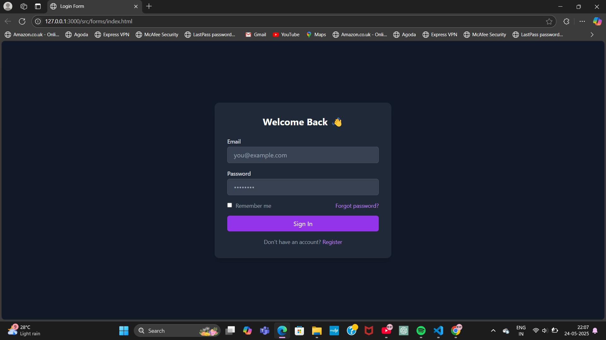

# 🔐 Login / Register Form – TailwindCSS Component

This is a responsive **Login Form** built using **TailwindCSS** with support for dark mode, hover/focus states, and clean visual feedback.  
It’s part of my growing collection of Tailwind practice components, where I learn, build, and document UI pieces just like a curious kid in a candy store of CSS! 🍭

---

## 📸 Preview



> 

---

## 📁 Folder Structure

```

src/
└── forms/
    ├── index.html       # Main form layout
    └── README.md        # This file 😊
```

---

## 🧠 What I Learned

I learned how to:

- Style a login form responsively with Tailwind

- Use utility classes like `bg-gray-100`, `dark:bg-gray-900`, and `focus:ring-*`
- Make the layout center using Flexbox
- Add interactivity with `hover:`, `focus:`, `dark:` variants
- Apply good UI spacing, shadows, rounded corners

---

## 🧱 Tailwind Concepts Used

| Concept          | Explanation                                                                 |
|------------------|-----------------------------------------------------------------------------|
| `bg-*`           | Background color like `bg-white`, `bg-gray-100`, `dark:bg-gray-900`         |
| `text-*`         | Text color and size like `text-gray-600`, `text-2xl`, `font-bold`           |
| `flex`, `justify-center`, `items-center` | Centering the form both vertically and horizontally                |
| `p-*` / `px-*`   | Padding utilities like `p-4`, `px-4`, `py-2` for spacing                    |
| `rounded-*`      | Rounded borders like `rounded-md`, `rounded-xl`                            |
| `shadow-lg`      | Adds a soft drop shadow to the form card                                   |
| `focus:*`        | On input focus, we add `focus:outline-none`, `focus:ring-2`, `focus:ring-purple-500` |
| `hover:*`        | Adds hover effect to the button with `hover:bg-purple-700`                 |
| `dark:*`         | Supports dark mode with `dark:bg-gray-800`, `dark:text-gray-300`           |
| `transition`     | Smooth animations on hover/focus                                           |

---

## ✨ Features

- ✅ Fully responsive (mobile-friendly)
- 🌙 Dark mode ready
- 🖱️ Hover and focus interactions
- 📨 Email/password fields
- 🔄 Register switch
- ✅ Accessible HTML elements
- 🎨 Clean layout using Tailwind utility classes

---

## 🛠️ How to Use

1. Make sure Tailwind is configured and compiled properly in your project:

   ```bash
   npx tailwindcss -i ./src/input.css -o ./dist/style.css --watch
   ```

2. Open the form in your browser:

   ```

   src/forms/index.html
   ```

---

## 💡 Improvements You Can Try

- Add form validation messages (bonus!)
- Animate login button during loading
- Toggle between login and register tabs
- Add a background image or hero illustration
- Fully functional backend (someday 😅)

---

## 📝 My Thought as I Built This

> “It felt like dressing up a doll! Each utility class made the form prettier and smarter. And when I saw the dark mode work... wow, Tailwind is just magic!” 💜

---

## 📦 Reuse Tip

This component is part of my larger **TailwindCSS-Practise Library**, which includes:

- Buttons
- Cards (Profile, Blog, Product)
- Navbar
- And more…

Each with their own folder, a README, and lots of curiosity sprinkled in 🌟

---
**Made with 💻 and 🎨 by Yukti Sahu**